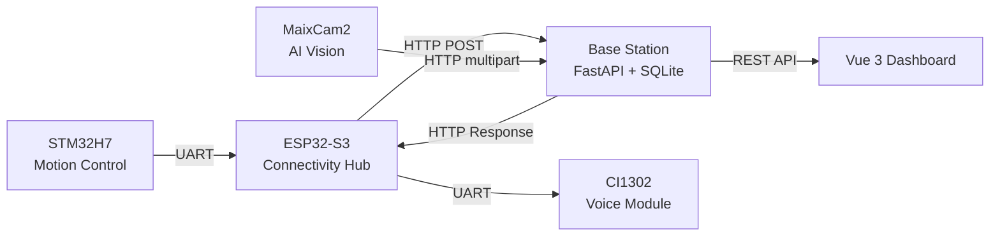

# Smart Agri Robot

这是一个自主农药喷洒机器人的全套控制系统。团队完成了从 STM32 底层驱动、ESP32 通信桥接、MaixCam2 视觉识别到 FastAPI + Vue 管理后台的全部开发。

机器人通过 NFC 识别地块，MaixCam2 做 YOLOv5 病虫害检测，三通道蠕动泵按处方配药，基站实时监控整个农场状态。

## System Architecture

## Hardware

| Component | Chip/Module | Role |
|-----------|-------------|------|
| Main Controller | STM32H7B0VBTx (M7, 280MHz) | Motor, servo, pump, NFC, sensors |
| Communication | ESP32-S3-N16R8 | WiFi bridge, UART hub, voice relay |
| Vision | Sipeed MaixCam2 (AX630C NPU) | YOLOv5 pest detection, visual servoing |
| Peripherals | PN532, CI1302, WS2812B, HC-SR04, JY61 | NFC read, voice broadcast, RGB status, distance, IMU |

## Modules

| Module | Directory | What's Inside |
|--------|-----------|---------------|
| Base Station | [`base-station/`](base-station/) | FastAPI backend + Vue 3 dashboard |
| ESP32 Firmware | [`esp32/`](esp32/) | MicroPython, UART bridging, HTTP client |
| MaixCam2 Vision | [`maixcam2/`](maixcam2/) | YOLOv5 model, visual servoing pipeline |
| STM32 Control | [`stm32/`](stm32/) | HAL-based motor/spray/sensor firmware |

## Tech Stack

| Layer | Technology |
|-------|------------|
| Backend | Python FastAPI + SQLite (raw SQL) |
| Frontend | Vue 3 (Composition API) + Vite + Tailwind CSS |
| ESP32 | MicroPython |
| STM32 | C, STM32CubeMX HAL, CMake, arm-none-eabi-gcc |
| Vision | MaixPy, YOLOv5, custom HSV pre-filter |

## Workflow

1. **NFC 识别** — STM32 读取地块 NFC 标签，通过 UART 传给 ESP32
2. **事件上报** — ESP32 通过 WiFi 向基站 POST 设备事件
3. **视觉检测** — MaixCam2 靠近作物，YOLO 检测病虫害，上传图片
4. **处方计算** — 基站根据病虫害类型、农药安全间隔期计算配药方案
5. **执行喷洒** — ESP32 轮询处方，下发给 STM32，三通道泵按比例混合喷洒
6. **回写记录** — 操作日志上传，仪表盘实时刷新

## Quick Start

每个模块有自己的 README，包含接线、编译和运行说明：

- [Base Station](base-station/README.md)
- [ESP32 Firmware](esp32/README.md)
- [MaixCam2 Vision](maixcam2/README.md)
- [STM32 Control](stm32/README.md)

## License

MIT — [LICENSE](LICENSE)

