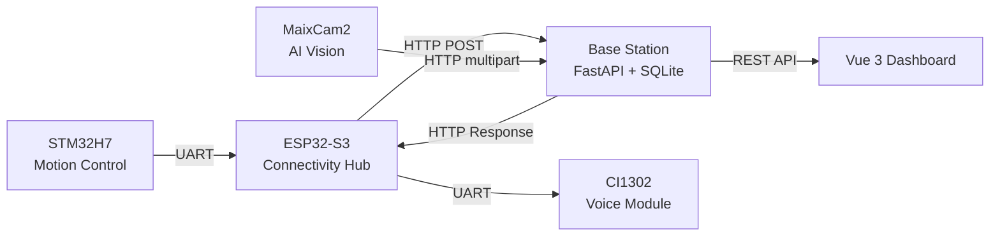

# Smart Agri Robot

An autonomous agricultural spraying robot system integrating STM32 motion control, ESP32 connectivity, MaixCam2 AI vision, and a FastAPI + Vue.js base station dashboard.

Designed for precision agriculture: NFC-tagged plot identification, YOLO-based pest detection, multi-channel pump dosing, and real-time farm management.

## System Architecture

## Modules

| Module | Directory | Description |
|--------|-----------|-------------|
| **Base Station** | [`base-station/`](base-station/) | Backend API server + Vue 3 management dashboard |
| **ESP32 Firmware** | [`esp32/`](esp32/) | MicroPython firmware for WiFi connectivity and UART bridging |
| **MaixCam2 Vision** | [`maixcam2/`](maixcam2/) | YOLOv5 pest detection with visual servoing for autonomous approach |
| **STM32 Control** | [`stm32/`](stm32/) | Main motion controller: motors, servos, pumps, NFC, sensors |

## Hardware

- **MCU**: STM32H7B0VBTx (ARM Cortex-M7)
- **WiFi/Bridge**: ESP32-S3-N16R8 (MicroPython)
- **Vision**: Sipeed MaixCam2 (AX630C + YOLOv5)
- **Peripherals**: PN532 NFC, CI1302 voice, WS2812B RGB, HC-SR04 ultrasonic, JY61 IMU, peristaltic pumps x3

## Tech Stack

| Layer | Technology |
|-------|------------|
| Backend | Python FastAPI, SQLite (raw SQL) |
| Frontend | Vue 3 (Composition API), Vite, Vue Router, Tailwind CSS |
| ESP32 | MicroPython |
| STM32 | C, STM32CubeMX, HAL, CMake |
| Vision | MaixPy, YOLOv5, UART serial protocol |

## Quick Start

Each module has its own README with setup instructions:

- [Base Station Setup](base-station/README.md)
- [ESP32 Firmware Setup](esp32/README.md)
- [MaixCam2 Vision Setup](maixcam2/README.md)
- [STM32 Build Guide](stm32/README.md)

## Workflow

1. **NFC Scan** — STM32 reads plot NFC tag, sends block ID to ESP32 via UART
2. **Event Upload** — ESP32 POSTs device event to base station over WiFi
3. **Visual Inspection** — MaixCam2 approaches crop, runs YOLO detection, uploads images
4. **Prescription** — Base station computes dosing plan (PHI safety lock, resistance prevention)
5. **Spray Execution** — ESP32 polls for prescription, relays to STM32, 3-channel pump mixing
6. **Write-back** — Operation log uploaded, dashboard updated in real time

## License

MIT — see [LICENSE](LICENSE)

---

*Independently designed and developed as a full-stack embedded-AI system.*
