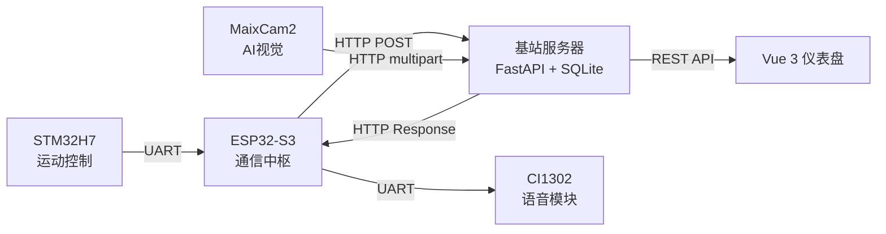

# 智慧农业机器人

一套自主农药喷洒机器人的全套控制系统。从 STM32 底层驱动、ESP32 通信桥接、MaixCam2 AI 视觉识别到 FastAPI + Vue.js 管理后台，全部由团队开发完成。

机器人通过 NFC 识别地块，MaixCam2 跑 YOLOv5 做病虫害检测，三通道蠕动泵按处方配药，基站实时监控整个农场的运行状态。

## 系统架构

## 硬件配置

| 组件 | 芯片/模块 | 作用 |
|------|-----------|------|
| 主控制器 | STM32H7B0VBTx (M7, 280MHz) | 电机、舵机、蠕动泵、NFC、传感器 |
| 通信 | ESP32-S3-N16R8 | WiFi 桥接、UART 中枢、语音中继 |
| 视觉 | Sipeed MaixCam2 (AX630C NPU) | YOLOv5 病虫害检测、视觉引导 |
| 外设 | PN532, CI1302, WS2812B, HC-SR04, JY61 | NFC 读卡、语音播报、RGB 状态、超声波、IMU |

## 模块说明

| 模块 | 目录 | 内容 |
|------|------|------|
| 基站 | [`base-station/`](base-station/) | FastAPI 后端 + Vue 3 管理仪表盘 |
| ESP32 固件 | [`esp32/`](esp32/) | MicroPython 固件，UART 桥接，HTTP 客户端 |
| MaixCam2 视觉 | [`maixcam2/`](maixcam2/) | YOLOv5 模型 + 视觉引导流程 |
| STM32 控制 | [`stm32/`](stm32/) | HAL 电机/喷洒/传感器固件 |

## 技术栈

| 层级 | 技术 |
|------|------|
| 后端 | Python FastAPI + SQLite（原生 SQL） |
| 前端 | Vue 3 (Composition API) + Vite + Tailwind CSS |
| ESP32 | MicroPython |
| STM32 | C, STM32CubeMX HAL, CMake, arm-none-eabi-gcc |
| 视觉 | MaixPy, YOLOv5, HSV 颜色预过滤 |

## 工作流程

1. **NFC 识别** — STM32 读取地块 NFC 标签，通过 UART 传给 ESP32
2. **事件上报** — ESP32 通过 WiFi 向基站 POST 设备事件
3. **视觉检测** — MaixCam2 靠近作物，YOLO 检测病虫害，上传图片
4. **处方计算** — 基站根据病虫害类型、农药安全间隔期计算配药方案
5. **执行喷洒** — ESP32 轮询处方，下发给 STM32，三通道泵按比例混合喷洒
6. **回写记录** — 操作日志上传，仪表盘实时刷新

## 快速开始

每个模块有自己的 README，包含了接线、编译和运行说明，可以直接跟着操作。

## 开源协议

MIT — 详见 [LICENSE](LICENSE)

